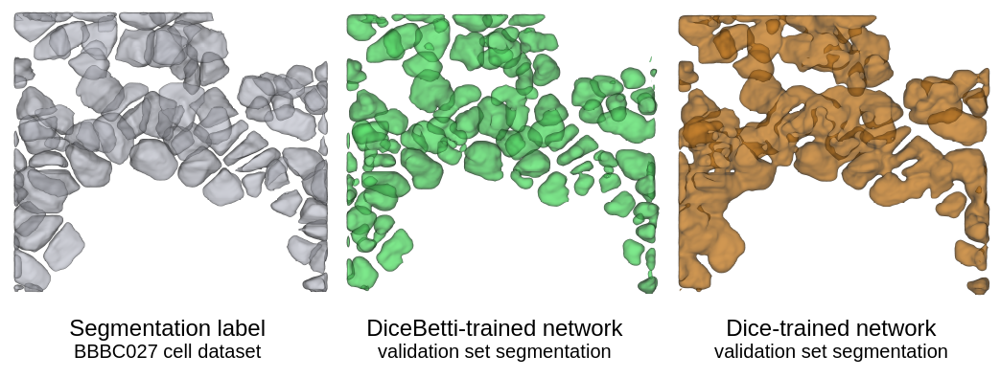
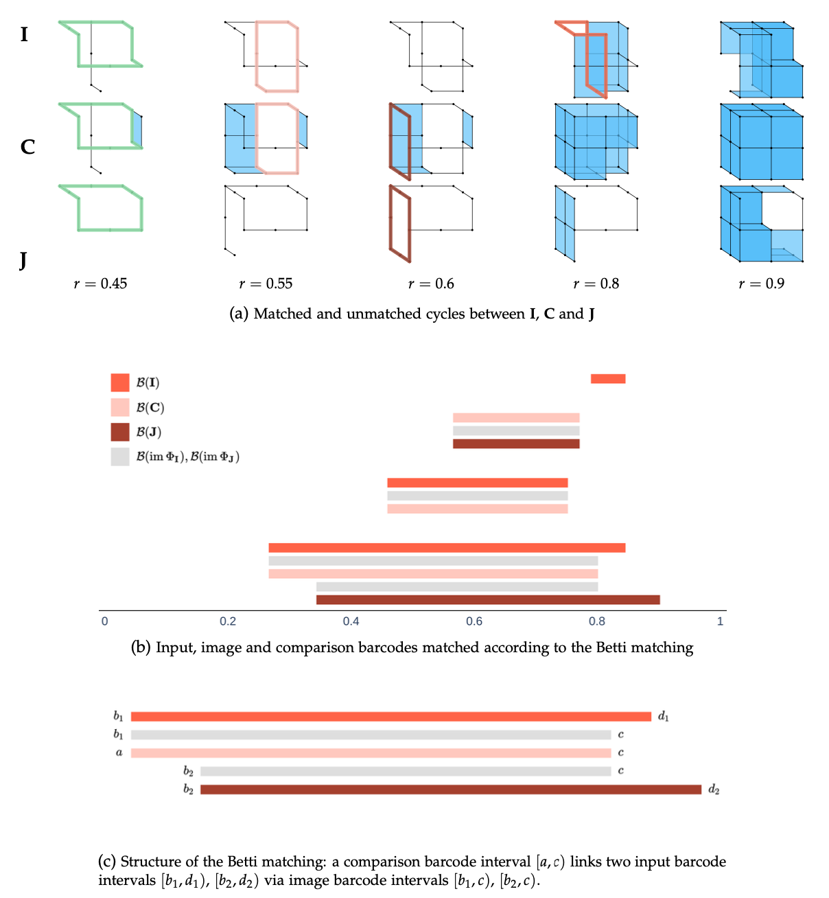
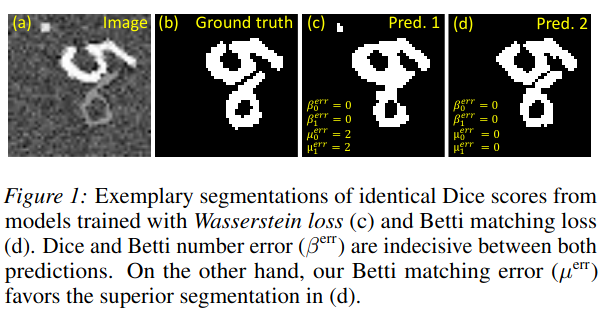

**Betti Matching**: Topological loss and metric for 3D image segmentation
========

[](https://arxiv.org/abs/2407.04683) [](https://opensource.org/licenses/MIT)



**What is Betti matching?** The topology of images is best captured by persistent homology, which can be represented in form of persistence barcodes. An interval in the barcode represents a topological feature, e.g. a connected component in dimension 0, a loop in dimension 1 or a cavity in dimension 2.



Betti matching is a framework, based on the theory of induced matchings (see https://arxiv.org/abs/1311.3681, https://arxiv.org/abs/2407.04683), that matches intervals representing topological features, which sptially correspond to each other. It defines the Betti matching loss, which enforces topologically accurate image segmentations during training, and the Betti matching error, which serves as a metric for the evaluation of segmentation tasks. It can be seen as a refinement of the well-established Betti number error, by counting the features in both images that do not spatially correspond to a feature in the other image.



**About the code**. We have provided the C++ code of Betti matching together with a pybind module that enables its usage directly in Python. The introduction.ipynb notebook introduces the implemented functions and explains their functionality.


## Installation

### Build from source
The executable should be easily build with C++11 compilers such as G++, Clang, or Microsoft C++.
To build the command-line executable from source:
	
	% mkdir build
    % cd build
    % cmake ..
    % make

If your system uses an Apple M2 chip you might have to replace the third line by

	% cmake -DCMAKE_OSX_ARCHITECTURES=arm64 ..


## Citing Betti matching
If you find our repository useful in your research, please cite the following:
```
@misc{stucki2024efficientbettimatchingenables,
    title={Efficient Betti Matching Enables Topology-Aware 3D Segmentation via Persistent Homology}, 
    author={Nico Stucki and Vincent Bürgin and Johannes C. Paetzold and Ulrich Bauer},
    year={2024},
    eprint={2407.04683},
    archivePrefix={arXiv},
    primaryClass={math.AT},
    url={https://arxiv.org/abs/2407.04683}, 
}
```

<!-- # License
-->

# Acknowledgement
We acknowledge the following repositories from where we have inherited code snippets or copied implementation details:

1. CubicalRipser_3dim: [[code](https://github.com/shizuo-kaji/CubicalRipser_3dim)][[paper](https://arxiv.org/abs/2005.12692)]

<!-- # Contributing
We actively welcome your pull requests! Please see [CONTRIBUTING.md](.github/CONTRIBUTING.md) and [CODE_OF_CONDUCT.md](.github/CODE_OF_CONDUCT.md) for more info. -->
